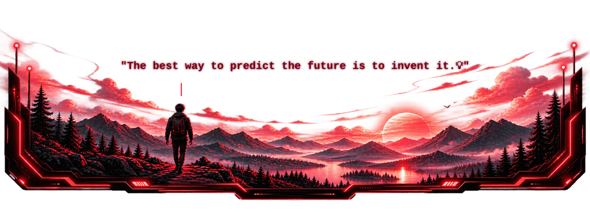

  <picture>
    <source media="(prefers-color-scheme: dark)"  srcset="assets/header-dark.svg">
    <source media="(prefers-color-scheme: light)" srcset="assets/header-light.svg">
    
  </picture>

  

  

 
<a href="https://github.com/bholushubhankaranokha?tab=repositories"></a>

  

<!-- GitHub Contribution Snake -->

  

  
  
  

